# 🎯 Complete Role & Functionality Flow Diagrams
## AksharJobs - AI-Based Resume & Job Matcher Platform

---

## 📋 Table of Contents
1. [System Overview](#system-overview)
2. [User Roles](#user-roles)
3. [Authentication & Registration Flow](#authentication--registration-flow)
4. [Job Seeker Flow Diagrams](#job-seeker-flow-diagrams)
5. [Recruiter Flow Diagrams](#recruiter-flow-diagrams)
6. [Common Features Flow](#common-features-flow)
7. [Technical Architecture Flow](#technical-architecture-flow)

---

## 🎯 System Overview

### Main User Roles
- **👤 Job Seekers** - Individuals looking for job opportunities
- **🏢 Recruiters** - Companies/individuals posting jobs and hiring
- **👑 Admin** - System administrators (limited scope)

### Core Technologies
- **Frontend**: React.js 18.2.0
- **Backend**: Python Flask
- **Database**: MongoDB Atlas with GridFS
- **AI Models**: Fine-tuned SBERT (R² Score: 0.753)
- **AI Integration**: Google Gemini API for resume parsing

---

## 🔐 Authentication & Registration Flow

### Complete User Registration Flow

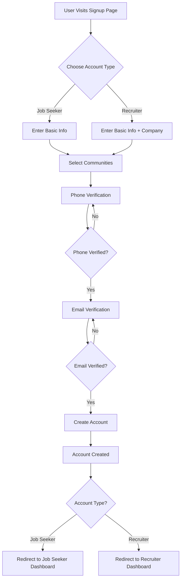

### Registration Details

#### **Step 1: Choose Account Type**
- Job Seeker
- Recruiter

#### **Step 2: Basic Information**
**Job Seekers:**
- First Name
- Last Name
- Email
- Phone Number
- Password
- Confirm Password

**Recruiters:**
- First Name
- Last Name
- Email
- Phone Number
- Company Name
- Password
- Confirm Password

#### **Step 3: Community Selection**
Select from 10 communities:
1. 🌍 All Communities (General)
2. 💻 Software Developers (Technology)
3. 📊 Data Scientists (Technology)
4. 🏥 Healthcare Workers (Healthcare)
5. 📢 Marketing Professionals (Marketing)
6. 💰 Finance Professionals (Finance)
7. 🎨 Designers (Design)
8. 💼 Sales Professionals (Sales)
9. 🎓 Education Professionals (Education)
10. ⚙️ Engineering (Engineering)

#### **Step 4: Phone Verification**
- Enter phone number
- Receive SMS with 6-digit code (via Celcom Africa API)
- Enter verification code
- 10-minute expiration
- 3-attempt limit
- Resend option available

#### **Step 5: Email Verification**
- Enter email address
- Receive email with 6-digit code (via SMTP)
- Enter verification code
- 10-minute expiration
- 3-attempt limit
- Resend option available

#### **Step 6: Account Creation**
- Both verifications must be complete
- Data stored in MongoDB
- JWT token generated
- Redirect to appropriate dashboard

---

### Login Flow

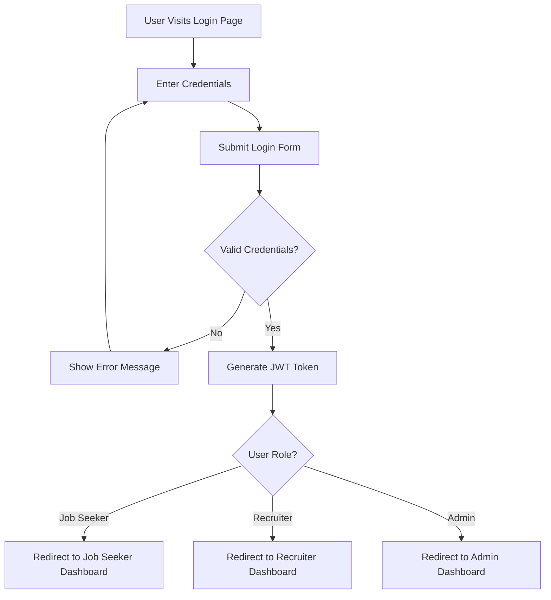

---

## 👤 Job Seeker Flow Diagrams

### Job Seeker Dashboard Overview

```mermaid
graph TD
    A[Job Seeker Dashboard] --> B[Profile Section]
    A --> C[Application Statistics]
    A --> D[Recent Jobs]
    A --> E[Match Score Overview]
    A --> F[Quick Actions]
    
    B --> B1[Profile Completion %]
    B --> B2[Profile Picture]
    B --> B3[Contact Information]
    
    C --> C1[Total Applications]
    C --> C2[Pending Applications]
    C --> C3[Interview Calls]
    C --> C4[Rejections]
    
    D --> D1[Recommended Jobs]
    D --> D2[Recently Posted Jobs]
    D --> D3[Community-Based Jobs]
    
    E --> E1[Average Match Score]
    E --> E2[Top Matches]
    E --> E3[Skills Gap Analysis]
    
    F --> F1[Upload Resume]
    F --> F2[Browse Jobs]
    F --> F3[Complete Profile]
    F --> F4[Track Applications]
```

---

### 1. Resume Upload & Management Flow

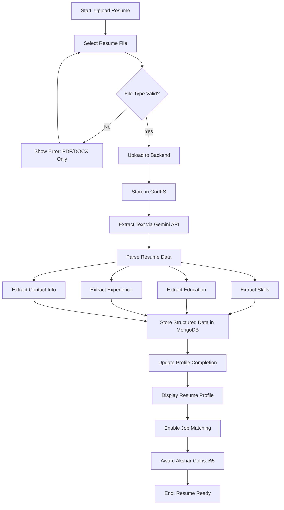

#### Resume Upload Details
**Accepted Formats:**
- PDF (.pdf)
- Word Document (.docx)

**AI Processing:**
- Text extraction via Google Gemini API
- Structured data parsing
- Skills identification
- Education parsing
- Work experience extraction
- Contact information extraction

**Data Stored:**
- Original file (GridFS)
- Parsed text
- Structured JSON data
- Skills array
- Education array
- Experience array

**Features:**
- View uploaded resume
- Download resume
- Update/Replace resume
- Preview resume
- Share resume link

---

### 2. Job Search & Application Flow

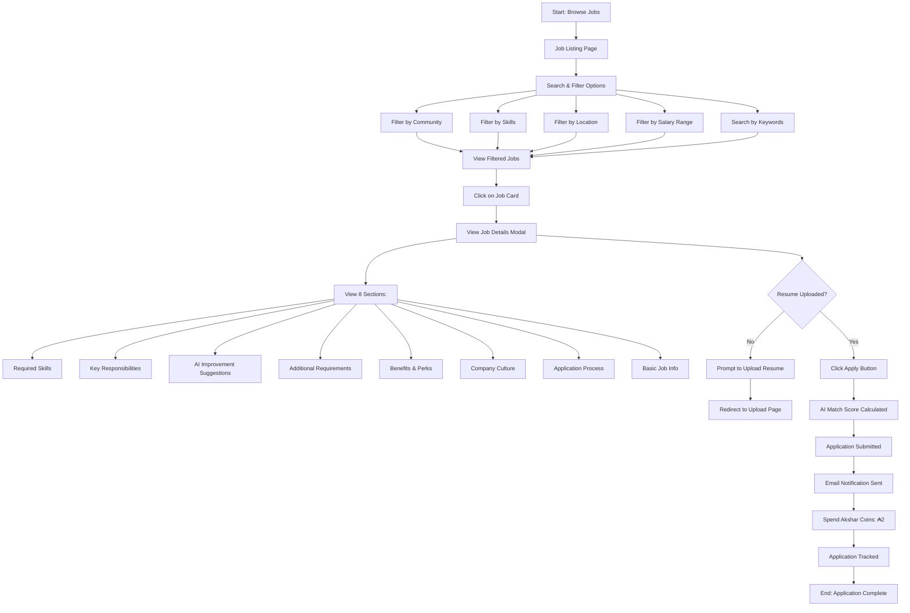

#### Job Search Features
**Search Options:**
- Keyword search
- Community-based filtering
- Skills matching
- Location-based search
- Salary range filter
- Company search
- Job type filter

**Job Display:**
- Beautiful gradient cards
- Skill tags with hover effects
- Company information
- Location and salary
- Match score indicator
- Posted date
- Application count

**Job Details (8 Sections):**
1. **🛠️ Required Skills** (10-12 skills)
2. **📋 Key Responsibilities** (8 responsibilities)
3. **💡 AI-Powered Improvement Suggestions** (5 personalized tips)
4. **📚 Additional Requirements** (5 soft skills)
5. **🎁 Benefits & Perks** (7 comprehensive benefits)
6. **🏢 Company Culture** (detailed description)
7. **📝 Application Process** (5-step process)
8. **📋 Basic Job Information** (title, company, location, salary, etc.)

---

### 3. Application Tracking Flow

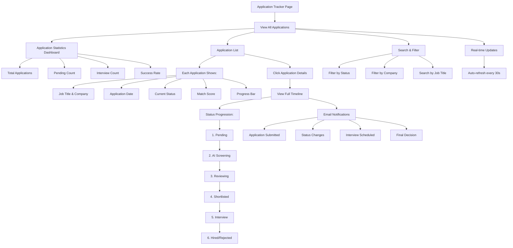

#### Application Status Flow
**Status Progression:**
1. **Pending** - Application submitted, awaiting review
2. **AI Screening** - AI evaluating match score
3. **Reviewing** - Recruiter reviewing application
4. **Shortlisted** - Selected for further consideration
5. **Interview** - Interview scheduled/completed
6. **Hired** - Selected for position
7. **Rejected** - Not selected (with feedback)

**Email Notifications:**
- Application confirmation
- Status change alerts
- Interview scheduling
- Final decision notification
- Custom recruiter messages

**Features:**
- Real-time status tracking
- Progress visualization
- Detailed timeline view
- Email notification history
- Application statistics
- Search and filter options
- Export application history

---

### 4. Profile Completion Flow

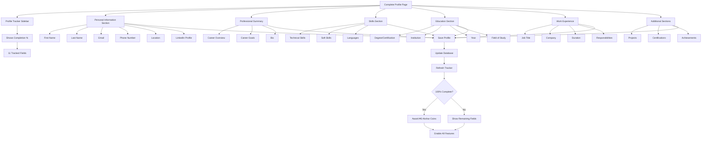

#### Profile Sections Detail

**Personal Information (Required):**
- First Name ✓
- Last Name ✓
- Email ✓
- Phone Number ✓
- Location ✓
- LinkedIn Profile (Optional)

**Professional Summary:**
- Career overview
- Key strengths
- Career objectives
- Professional bio

**Skills:**
- Technical skills (with proficiency levels)
- Soft skills
- Languages spoken
- Tools & technologies

**Education:**
- Degree/Certification
- Institution name
- Graduation year
- Field of study
- GPA (optional)

**Work Experience:**
- Job title
- Company name
- Employment duration
- Key responsibilities
- Achievements

**Additional Information:**
- Projects portfolio
- Certifications
- Achievements & awards
- Publications
- Volunteer work

**Profile Features:**
- Auto-save functionality
- Profile completion tracker
- Public profile link
- Download as PDF
- Share profile option

---

### 5. Contact Me Page (Job Seeker View)

```mermaid
graph TD
    A[Contact Me Page] --> B[Profile Header]
    B --> B1[Profile Picture]
    B --> B2[Full Name]
    B --> B3[Job Seeker Badge]
    B --> B4[Contact Information]
    
    A --> C[Personal Information Section]
    C --> C1[Email]
    C --> C2[Phone]
    C --> C3[Location]
    C --> C4[LinkedIn]
    
    A --> D[Professional Summary]
    D --> D1[Career Overview]
    D --> D2[Bio/Description]
    
    A --> E[Skills Section]
    E --> E1[Technical Skills Tags]
    E --> E2[Soft Skills Tags]
    E --> E3[Skill Proficiency Bars]
    
    A --> F[Education History]
    F --> F1[Degree Details]
    F --> F2[Institution]
    F --> F3[Year & Field]
    
    A --> G[Work Experience]
    G --> G1[Job Timeline]
    G --> G2[Responsibilities]
    G --> G3[Achievements]
    
    A --> H[Projects Portfolio]
    H --> H1[Project Details]
    H --> H2[Technologies Used]
    
    A --> I[Certifications]
    I --> I1[Certification List]
    I --> I2[Issue Dates]
    
    A --> J[Achievements & Awards]
    J --> J1[Achievement List]
    
    A --> K[Resume Download]
    K --> K1[Download PDF Button]
    K --> K2[Download DOCX Button]
    
    A --> L[Action Buttons]
    L --> L1[Edit Profile]
    L --> L2[Share Profile Link]
    L --> L3[Go to Dashboard]
```

---

### 6. Akshar Coin System (Job Seeker)

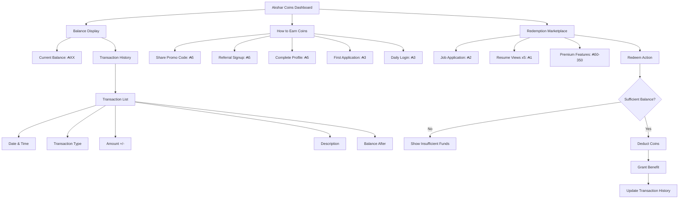

#### Akshar Coin Details

**Earning Methods (Max ₳5 per action):**
1. **Share Promo Code** - ₳5
   - Share unique referral code
   - Earn when code is used

2. **Referral Signup** - ₳5
   - Referred user creates account
   - Both earn coins

3. **Complete Profile** - ₳5
   - Achieve 100% profile completion
   - One-time reward

4. **First Application** - ₳3
   - Submit first job application
   - One-time bonus

5. **Daily Login** - ₳3
   - Login streak bonus
   - Daily reward

**Redemption Options:**
1. **Job Application** - ₳2
   - Apply for premium jobs
   - Featured applications

2. **Resume Views (Pack of 5)** - ₳1
   - See who viewed your resume
   - Tracking analytics

3. **Premium Basic** - ₳50
   - Advanced search features
   - Priority support

4. **Premium Pro** - ₳150
   - All Basic features
   - Skills assessment
   - Interview prep

5. **Premium Enterprise** - ₳350
   - All Pro features
   - Personal career coach
   - Resume writing service

---

## 🏢 Recruiter Flow Diagrams

### Recruiter Dashboard Overview

```mermaid
graph TD
    A[Recruiter Dashboard] --> B[Company Profile Section]
    A --> C[Recruitment Statistics]
    A --> D[Active Job Postings]
    A --> E[Recent Applications]
    A --> F[Profile Tracker]
    
    B --> B1[Company Logo]
    B --> B2[Company Name]
    B --> B3[Industry & Size]
    B --> B4[Profile Completion %]
    
    C --> C1[Total Jobs Posted]
    C --> C2[Active Applications]
    C --> C3[Candidates Shortlisted]
    C --> C4[Positions Filled]
    
    D --> D1[Job List with Status]
    D --> D2[Applications per Job]
    D --> D3[Average Match Score]
    
    E --> E1[Recent Applicants]
    E --> E2[Match Scores]
    E --> E3[Quick Actions]
    
    F --> F1[11 Profile Fields]
    F --> F2[Completion Progress]
    F --> F3[Complete Profile Button]
```

---

### 1. Recruiter Profile Completion Flow

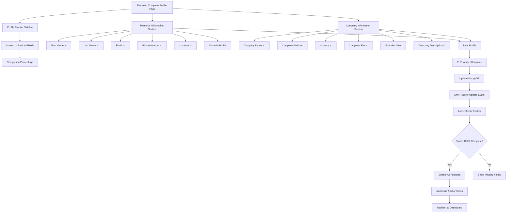

#### Recruiter Profile Fields (11 Total)

**Personal Information (6 fields):**
1. First Name ✓
2. Last Name ✓
3. Email ✓
4. Phone Number ✓
5. Location ✓
6. LinkedIn Profile (Optional)

**Company Information (6 fields):**
7. Company Name ✓
8. Company Website (Optional)
9. Industry ✓ (Dropdown with 20+ options)
10. Company Size ✓ (1-10, 11-50, 51-200, 201-500, 501-1000, 1000+)
11. Founded Year (Optional)
12. Company Description ✓

**✓ = Required field**

---

### 2. Job Posting Flow

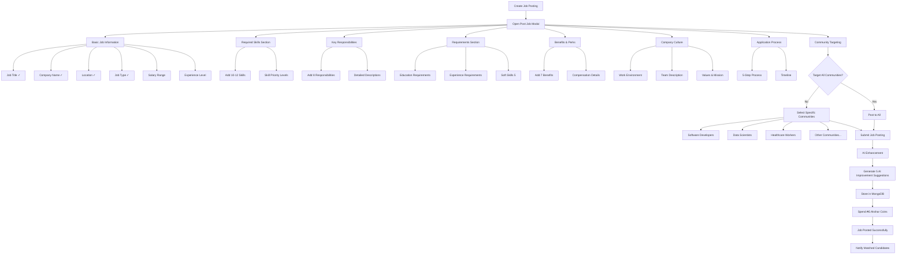

#### Job Posting Structure (8 Sections)

**1. Basic Job Information:**
- Job Title ✓
- Company Name ✓
- Location ✓
- Job Type ✓ (Full-time, Part-time, Contract, Internship)
- Salary Range
- Experience Level (Entry, Mid, Senior)
- Remote/On-site/Hybrid
- Posted Date (Auto)

**2. Required Skills (10-12 skills):**
- Technical skills with priority levels
- Must-have vs Nice-to-have
- Skill proficiency expectations

**3. Key Responsibilities (8 items):**
- Detailed day-to-day tasks
- Project responsibilities
- Team collaboration duties
- Performance expectations

**4. AI-Powered Improvement Suggestions (5 items):**
- Automatically generated by AI
- Personalized career tips
- Skill development recommendations
- Interview preparation advice
- Portfolio building suggestions

**5. Additional Requirements (5 items):**
- Soft skills needed
- Communication abilities
- Problem-solving skills
- Teamwork capabilities
- Leadership qualities

**6. Benefits & Perks (7 items):**
- Competitive salary
- Health insurance
- Retirement plans
- Flexible work arrangements
- Professional development
- Work-life balance initiatives
- Additional perks

**7. Company Culture:**
- Work environment description
- Team dynamics
- Company values
- Mission statement
- Growth opportunities

**8. Application Process (5 steps):**
1. Submit resume and cover letter
2. Initial screening call
3. Technical assessment
4. Team interviews
5. Final decision and offer

---

### 3. Candidate Browsing & Filtering Flow (CV Browser)

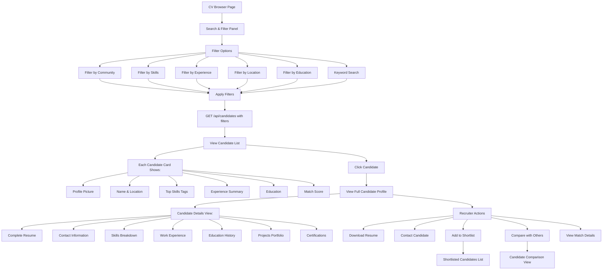

#### CV Browser Features

**Search Capabilities:**
- Keyword search across resumes
- Boolean search operators
- Search by name, skills, or company
- Location-based search
- Saved search filters

**Filter Options:**
1. **Community Filter** - Select from 10 communities
2. **Skills Filter** - Multi-select skill matching
3. **Experience Filter** - Years of experience range
4. **Location Filter** - City/country selection
5. **Education Filter** - Degree level & field
6. **Availability Filter** - Immediate, notice period

**Candidate Card Information:**
- Profile photo
- Full name
- Current role/title
- Years of experience
- Top 5 skills
- Education level
- Location
- Availability status
- Match score (if applied to job)
- Last active date

**Bulk Actions:**
- Select multiple candidates
- Export to CSV
- Send bulk emails
- Add to shortlist
- Move to different stages

---

### 4. Application Management Flow (Recruiter Tracker)

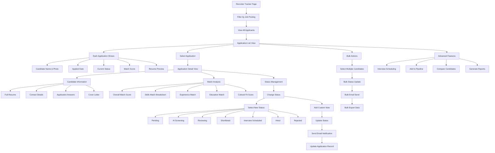

#### Application Management Features

**Status Management:**
1. **Pending** - New application, not yet reviewed
2. **AI Screening** - Automated AI evaluation
3. **Reviewing** - Manual review in progress
4. **Shortlisted** - Selected for interview
5. **Interview** - Interview stage (with sub-stages)
6. **Hired** - Offer accepted
7. **Rejected** - Not selected (with reason)

**Interview Sub-stages:**
- Phone screening scheduled
- Phone screening completed
- Technical interview scheduled
- Technical interview completed
- Final interview scheduled
- Final interview completed
- Offer pending

**Bulk Actions:**
- Select multiple applications
- Bulk status updates
- Bulk email notifications
- Export selected applications
- Move to different job postings
- Archive applications

**Email Templates:**
- Application received confirmation
- Screening passed notification
- Interview invitation
- Interview reminder
- Offer letter
- Rejection (with feedback)
- Custom templates

**Real-time Features:**
- Auto-refresh every 30 seconds
- Live notification of new applications
- Real-time status updates
- Instant email notifications
- Activity tracking

---

### 5. Analytics Dashboard (Recruiter)

```mermaid
graph TD
    A[Analytics Dashboard] --> B[Match Score Thresholds]
    A --> C[Skills Gap Analysis]
    A --> D[Matching History]
    A --> E[Competitor Analysis]
    A --> F[Performance Metrics]
    
    B --> B1[Set Minimum Threshold]
    B --> B2[Set Auto-Reject Threshold]
    B --> B3[Per-Job Configuration]
    B --> B4[Filter Candidates Automatically]
    
    C --> C1[Select Job Posting]
    C --> C2[Analyze All Candidates]
    C --> C3[Skills Match Breakdown]
    C --> C4[Missing Skills Report]
    C --> C5[Match Percentage]
    
    D --> D1[Historical Performance]
    D --> D2[Application Volume Over Time]
    D --> D3[Average Match Scores]
    D --> D4[High-Quality Candidate Count]
    D --> D5[Conversion Rates]
    
    E --> E1[Market Salary Ranges]
    E --> E2[Competitor Job Analysis]
    E --> E3[Industry Benchmarks]
    E --> E4[Demand Insights]
    
    F --> F1[Total Applications]
    F --> F2[Applications per Job]
    F --> F3[Time to Hire]
    F --> F4[Quality of Hire]
    F --> F5[Source Effectiveness]
    
    A --> G[Visualizations]
    G --> G1[Bar Charts]
    G --> G2[Line Graphs]
    G --> G3[Pie Charts]
    G --> G4[Heat Maps]
    G --> G5[Trend Analysis]
```

#### Analytics Features Detail

**1. Match Score Thresholds:**
- Set minimum match score (e.g., 70%)
- Set auto-reject threshold (e.g., 30%)
- Configure per job posting
- Automatic candidate filtering
- Real-time threshold adjustment

**2. Skills Gap Analysis:**
- Compare required skills vs candidate skills
- Visual breakdown of matched skills
- Identify missing critical skills
- Skills proficiency comparison
- Prioritize training needs
- Generate skills reports

**3. Matching History:**
- Track job posting performance
- Application volume trends
- Average match scores over time
- High-quality candidate metrics (>80% match)
- View to application conversion
- Time-based analytics

**4. Competitor Analysis:**
- Similar job postings in market
- Salary benchmarking
- Industry demand trends
- Skills in demand
- Market insights
- Competitive positioning

**5. Recruitment Performance Metrics:**
- Total jobs posted
- Active vs filled positions
- Applications per job
- Average time to hire
- Candidate quality scores
- Interview to hire ratio
- Source tracking (where candidates come from)

**6. Dashboard Summary:**
- Key Performance Indicators (KPIs)
- Weekly/Monthly comparisons
- Goals vs actual metrics
- Recruitment funnel visualization
- Cost per hire
- Quality of hire scores

---

### 6. Contact Me Page (Recruiter View)

```mermaid
graph TD
    A[Contact Me Page - Recruiter] --> B[Profile Header]
    B --> B1[Company Logo]
    B --> B2[Full Name]
    B --> B3[Recruiter Badge 🏢]
    B --> B4[Contact Information]
    
    A --> C[Personal Information]
    C --> C1[Email]
    C --> C2[Phone]
    C --> C3[Location]
    C --> C4[LinkedIn]
    
    A --> D[Company Information Section]
    D --> D1[Company Name Display]
    D --> D2[Company Website]
    D --> D3[Industry]
    D --> D4[Company Size]
    D --> D5[Founded Year]
    
    A --> E[Company Description]
    E --> E1[Blue-themed Section]
    E --> E2[Detailed Company Info]
    E --> E3[Mission & Values]
    
    A --> F[Action Buttons]
    F --> F1[Edit Profile]
    F --> F2[Go to Dashboard]
    F --> F3[Share Company Profile]
    
    A --> G[NO Resume Sections]
    G --> G1[❌ Professional Summary]
    G --> G2[❌ Skills]
    G --> G3[❌ Education]
    G --> G4[❌ Work Experience]
    G --> G5[❌ Projects]
    G --> G6[❌ Certifications]
    G --> G7[❌ Download Resume]
```

#### Key Differences: Job Seeker vs Recruiter Contact Page

| Feature | Job Seeker | Recruiter |
|---------|------------|-----------|
| Badge | "Job Seeker" 👤 | "Recruiter" 🏢 |
| Profile Picture | Personal Photo | Company Logo |
| Resume Sections | ✅ Shown | ❌ Hidden |
| Company Info | ❌ Not shown | ✅ Shown |
| Company Description | ❌ Not shown | ✅ Blue-themed section |
| Download Resume | ✅ Shown | ❌ Hidden |
| Skills Display | ✅ Tag clouds | ❌ Not shown |
| Work Experience | ✅ Timeline view | ❌ Not shown |

---

## 🌐 Common Features Flow

### 1. Promo Code & Referral System

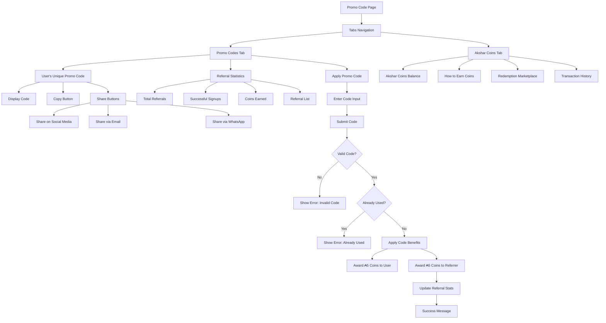

#### Promo Code Features

**Unique Promo Code:**
- Each user gets unique code
- Format: USERNAME_XXXX
- Permanent code (doesn't expire)
- Shareable across platforms

**Sharing Options:**
- Copy to clipboard
- Share on Facebook
- Share on Twitter
- Share on LinkedIn
- Share via Email
- Share via WhatsApp
- Generate QR code

**Referral Tracking:**
- Total referrals count
- Successful signups
- Pending referrals
- Total coins earned
- Referral history with dates
- Referred user names (if permitted)

**Benefits:**
- Referrer earns ₳5 coins
- New user earns ₳5 coins
- Both users notified via email
- Tracked in transaction history
- Unlimited referrals allowed

---

### 2. Community System Flow

```mermaid
graph TD
    A[Community System] --> B[Community Selection]
    B --> C[Available Communities]
    
    C --> C1[🌍 All Communities]
    C --> C2[💻 Software Developers]
    C --> C3[📊 Data Scientists]
    C --> C4[🏥 Healthcare Workers]
    C --> C5[📢 Marketing Professionals]
    C --> C6[💰 Finance Professionals]
    C --> C7[🎨 Designers]
    C --> C8[💼 Sales Professionals]
    C --> C9[🎓 Education Professionals]
    C --> C10[⚙️ Engineering]
    
    B --> D[User Actions]
    D --> D1[Select During Signup]
    D --> D2[Update in Profile]
    D --> D3[Select Multiple]
    
    A --> E[Community Features]
    E --> E1[Community-Based Job Feed]
    E --> E2[Community Member Search]
    E --> E3[Community Statistics]
    
    E1 --> F[Job Seeker View]
    F --> F1[See Jobs in My Communities]
    F --> F2[Prioritize Matching Jobs]
    F --> F3[Get Community Job Alerts]
    
    E2 --> G[Recruiter View]
    G --> G1[Post Job to Communities]
    G --> G2[Filter Candidates by Community]
    G --> G3[View Community Analytics]
    
    E3 --> H[Community Data]
    H --> H1[Total Members]
    H --> H2[Active Jobs]
    H --> H3[Average Match Score]
    H --> H4[Engagement Metrics]
```

#### Community System Details

**Community Categories:**
1. **General** - All Communities (universal access)
2. **Technology** - Software Developers, Data Scientists
3. **Healthcare** - Healthcare Workers, Medical Professionals
4. **Creative** - Designers, Content Creators
5. **Business** - Marketing, Sales, Finance
6. **Education** - Educators, Trainers
7. **Engineering** - Various engineering disciplines

**Community Features:**
- Icon and color-coded badges
- Community descriptions
- Member count display
- Active job count
- Average salary range
- Top skills in community

**Job Posting to Communities:**
- Select target communities
- Post to all communities option
- Community-specific requirements
- Reach metrics per community
- Community engagement analytics

**Community-Based Matching:**
- Prioritize same community jobs
- Community fit score
- Cross-community recommendations
- Community networking opportunities

---

### 3. Settings & Preferences Flow

```mermaid
graph TD
    A[Settings Page] --> B[Account Settings]
    A --> C[Profile Settings]
    A --> D[Privacy Settings]
    A --> E[Notification Settings]
    A --> F[Display Settings]
    A --> G[Security Settings]
    
    B --> B1[Change Email]
    B --> B2[Change Password]
    B --> B3[Change Phone]
    B --> B4[Account Type]
    B --> B5[Delete Account]
    B --> B6[Deactivate Account]
    
    C --> C1[Edit Profile Picture]
    C --> C2[Update Personal Info]
    C --> C3[Update Company Info - Recruiter]
    C --> C4[Profile Visibility]
    
    D --> D1[Data Privacy Controls]
    D --> D2[Resume Visibility]
    D --> D3[Contact Information Visibility]
    D --> D4[Activity Privacy]
    D --> D5[Search Visibility]
    
    E --> E1[Email Notifications]
    E --> E2[SMS Notifications]
    E --> E3[Push Notifications]
    E --> E4[Application Updates]
    E --> E5[Job Alerts]
    E --> E6[Marketing Emails]
    
    F --> F1[Theme Selection]
    F --> F2[Language]
    F --> F3[Timezone]
    F --> F4[Date Format]
    
    G --> G1[Two-Factor Authentication]
    G --> G2[Active Sessions]
    G --> G3[Login History]
    G --> G4[Connected Devices]
    G --> G5[Security Logs]
```

#### Settings Categories

**Account Settings:**
- Email management with verification
- Password change (requires current password)
- Phone number update with SMS verification
- Account type (Job Seeker/Recruiter)
- Delete account (with confirmation)
- Deactivate account (temporary)

**Profile Settings:**
- Profile picture upload
- Personal information updates
- Company information (Recruiters)
- Bio/description
- Public profile visibility
- Profile completion status

**Privacy Settings:**
- Who can see my resume
- Contact information visibility
- Activity status (online/offline)
- Search engine indexing
- Data download request
- Data deletion request

**Notification Preferences:**
- Email notifications on/off
- SMS notifications on/off
- Push notifications on/off
- Job application status updates
- New job alerts
- Interview reminders
- Message notifications
- Marketing communications

**Display Settings:**
- Light/Dark theme
- Language selection (Multi-language support)
- Timezone selection
- Date and time format
- Currency preference
- Accessibility options

**Security Settings:**
- Two-factor authentication setup
- Active sessions list
- Login history with IP addresses
- Connected devices
- Security alerts
- Password strength requirements

---

### 4. Notification System Flow

```mermaid
graph TD
    A[Notification System] --> B[Email Notifications]
    A --> C[In-App Notifications]
    A --> D[SMS Notifications]
    
    B --> E[Job Seeker Email Types]
    E --> E1[Application Submitted]
    E --> E2[Application Status Changed]
    E --> E3[Interview Scheduled]
    E --> E4[New Job Match]
    E --> E5[Profile View Alert]
    E --> E6[Referral Signup]
    E --> E7[Coins Earned/Spent]
    
    B --> F[Recruiter Email Types]
    F --> F1[New Application Received]
    F --> F2[Candidate Status Updated]
    F --> F3[Job Posting Approved]
    F --> F4[High Match Candidate]
    F --> F5[Interview Reminder]
    F --> F6[Subscription Renewal]
    
    C --> G[In-App Notification Bell]
    G --> G1[Unread Count Badge]
    G --> G2[Notification Dropdown]
    G --> G3[Mark as Read]
    G --> G4[View All Notifications]
    
    C --> H[Notification Types]
    H --> H1[Info Notifications]
    H --> H2[Success Notifications]
    H --> H3[Warning Notifications]
    H --> H4[Error Notifications]
    
    D --> I[SMS Triggers]
    I --> I1[Verification Codes]
    I --> I2[Interview Reminders]
    I --> I3[Urgent Status Changes]
    I --> I4[Security Alerts]
    
    A --> J[Notification Management]
    J --> J1[Notification Preferences]
    J --> J2[Frequency Settings]
    J --> J3[Quiet Hours]
    J --> J4[Unsubscribe Options]
```

---

## 🔧 Technical Architecture Flow

### System Architecture Overview

```mermaid
graph TD
    A[User Browser] --> B[React Frontend]
    B --> C[Axios API Client]
    C --> D[Flask Backend]
    
    D --> E[Authentication Middleware]
    E --> F{JWT Valid?}
    F -->|No| G[Return 401 Error]
    F -->|Yes| H[Route Controllers]
    
    H --> I[Auth Routes]
    H --> J[Job Routes]
    H --> K[Resume Routes]
    H --> L[Application Routes]
    H --> M[Analytics Routes]
    H --> N[Coin Routes]
    H --> O[Community Routes]
    
    I --> P[MongoDB]
    J --> P
    K --> P
    L --> P
    M --> P
    N --> P
    O --> P
    
    K --> Q[GridFS]
    Q --> R[Resume Files Storage]
    
    K --> S[Google Gemini API]
    S --> T[Text Extraction]
    T --> U[Resume Parsing]
    
    J --> V[SBERT Model]
    V --> W[Match Score Calculation]
    W --> X[Semantic Similarity]
    
    P --> Y[Collections]
    Y --> Y1[users]
    Y --> Y2[jobs]
    Y --> Y3[applications]
    Y --> Y4[resumes]
    Y --> Y5[communities]
    Y --> Y6[transactions]
    Y --> Y7[notifications]
```

---

### AI Matching Engine Flow

```mermaid
graph TD
    A[Job Application Submitted] --> B[Retrieve Resume Data]
    B --> C[Retrieve Job Description]
    
    C --> D[Extract Resume Features]
    D --> D1[Skills Array]
    D --> D2[Education Details]
    D --> D3[Experience Details]
    D --> D4[Resume Text]
    
    C --> E[Extract Job Features]
    E --> E1[Required Skills]
    E --> E2[Job Description Text]
    E --> E3[Requirements]
    E --> E4[Experience Needed]
    
    D1 --> F[Skills Matching]
    E1 --> F
    F --> G[Calculate Skills Score 40%]
    
    D2 --> H[Education Matching]
    E3 --> H
    H --> I[Calculate Education Score 20%]
    
    D3 --> J[Experience Matching]
    E4 --> J
    J --> K[Calculate Experience Score 20%]
    
    D4 --> L[SBERT Model]
    E2 --> L
    L --> M[Semantic Similarity]
    M --> N[Calculate Semantic Score 20%]
    
    G --> O[Weighted Average]
    I --> O
    K --> O
    N --> O
    
    O --> P[Final Match Score 0-100%]
    P --> Q[Store in Application]
    Q --> R[Return to User]
    
    P --> S{Score >= 80%?}
    S -->|Yes| T[High Match - Priority]
    S -->|No| U{Score >= 60%?}
    U -->|Yes| V[Good Match - Standard]
    U -->|No| W{Score >= 40%?}
    W -->|Yes| X[Fair Match - Review]
    W -->|No| Y[Low Match - Consider]
```

#### Match Score Breakdown

**Weighted Components (Total: 100%):**

1. **Skills Match (40%):**
   - Exact skill matches
   - Similar skill matches
   - Skill proficiency levels
   - Number of matched skills
   - Critical skills weight

2. **Education Match (20%):**
   - Degree level match
   - Field of study relevance
   - Institution ranking
   - Certifications match
   - Additional qualifications

3. **Experience Match (20%):**
   - Years of experience
   - Industry experience
   - Similar roles held
   - Company size/type match
   - Leadership experience

4. **Semantic Similarity (20%):**
   - SBERT model analysis
   - Text similarity score
   - Context understanding
   - Job-resume alignment
   - Language patterns

**Match Score Categories:**
- **90-100%** - Excellent Match 🟢
- **80-89%** - Very Good Match 🟢
- **70-79%** - Good Match 🟡
- **60-69%** - Moderate Match 🟡
- **50-59%** - Fair Match 🟠
- **40-49%** - Low Match 🟠
- **0-39%** - Poor Match 🔴

---

### Resume Parsing Flow with Gemini AI

```mermaid
graph TD
    A[Resume File Uploaded] --> B{File Type?}
    B -->|PDF| C[Extract PDF Text]
    B -->|DOCX| D[Extract DOCX Text]
    
    C --> E[Raw Text Extracted]
    D --> E
    
    E --> F[Send to Gemini API]
    F --> G[Gemini AI Processing]
    
    G --> H[Structured Data Extraction]
    H --> I[Personal Information]
    H --> J[Contact Details]
    H --> K[Professional Summary]
    H --> L[Skills]
    H --> M[Education]
    H --> N[Work Experience]
    H --> O[Projects]
    H --> P[Certifications]
    
    I --> Q[JSON Structure]
    J --> Q
    K --> Q
    L --> Q
    M --> Q
    N --> Q
    O --> Q
    P --> Q
    
    Q --> R[Validate & Clean Data]
    R --> S[Store in MongoDB]
    
    A --> T[Store Original File]
    T --> U[GridFS Storage]
    
    S --> V[Update User Profile]
    U --> V
    V --> W[Resume Ready for Matching]
```

#### Gemini AI Extraction Details

**Extracted Fields:**

**1. Personal Information:**
- Full name
- Date of birth (if available)
- Nationality
- Languages spoken

**2. Contact Details:**
- Email addresses
- Phone numbers
- LinkedIn profile
- GitHub/Portfolio links
- Location/Address

**3. Professional Summary:**
- Career overview
- Key strengths
- Career objectives
- Professional headline

**4. Skills (Categorized):**
- Technical skills
- Programming languages
- Frameworks & tools
- Soft skills
- Domain knowledge
- Certifications-related skills

**5. Education:**
- Degree/Diploma
- Institution name
- Graduation year
- Field of study
- GPA/Grade (if available)
- Academic achievements

**6. Work Experience:**
- Job title
- Company name
- Employment period
- Location
- Key responsibilities
- Achievements
- Technologies used

**7. Projects:**
- Project name
- Description
- Technologies used
- Role in project
- Project duration
- Project links

**8. Certifications:**
- Certification name
- Issuing organization
- Issue date
- Expiry date (if applicable)
- Credential ID

---

### Data Flow Architecture

```mermaid
graph LR
    A[React Components] --> B[API Services]
    B --> C[Axios HTTP Client]
    C --> D[Flask API Routes]
    
    D --> E[Authentication Middleware]
    E --> F[Business Logic Services]
    
    F --> G[Database Models]
    G --> H[MongoDB]
    
    F --> I[External APIs]
    I --> I1[Gemini AI]
    I --> I2[SMS Service]
    I --> I3[Email Service]
    
    F --> J[AI Models]
    J --> J1[SBERT]
    
    H --> K[Collections]
    H --> L[GridFS]
    
    K --> M[Query Results]
    L --> M
    
    M --> N[Response Data]
    N --> O[JSON Response]
    O --> P[Frontend State Update]
    P --> Q[UI Re-render]
```

---

## 📊 Complete Feature Matrix

### Job Seeker Features

| Feature | Description | Status |
|---------|-------------|--------|
| **Registration & Auth** |
| Signup with Verification | Phone + Email dual verification | ✅ |
| Login with JWT | Secure token-based authentication | ✅ |
| Password Reset | Email-based password recovery | ✅ |
| Two-Factor Auth | Additional security layer | ✅ |
| **Profile Management** |
| Complete Profile | 11-field comprehensive profile | ✅ |
| Profile Tracker | Visual completion tracking | ✅ |
| Upload Resume | PDF/DOCX support with AI parsing | ✅ |
| Profile Picture | Circular photo upload | ✅ |
| Contact Me Page | Public profile page | ✅ |
| **Job Search & Application** |
| Browse Jobs | Beautiful job listing page | ✅ |
| Search & Filter | Multi-criteria job search | ✅ |
| Community Filter | Community-based job filtering | ✅ |
| Job Details View | 8-section detailed view | ✅ |
| Apply for Jobs | One-click application | ✅ |
| AI Match Score | Automatic match calculation | ✅ |
| Save Jobs | Bookmark interesting jobs | ✅ |
| **Application Tracking** |
| Application Tracker | Real-time status tracking | ✅ |
| Status Updates | Email notifications | ✅ |
| Progress Timeline | Visual application journey | ✅ |
| Statistics Dashboard | Application metrics | ✅ |
| **Akshar Coins System** |
| Earn Coins | 5 earning methods | ✅ |
| Redeem Coins | Marketplace with options | ✅ |
| Transaction History | Complete coin tracking | ✅ |
| Balance Display | Current balance widget | ✅ |
| **Promo & Referral** |
| Unique Promo Code | Personal referral code | ✅ |
| Share Code | Social sharing options | ✅ |
| Referral Tracking | Statistics and history | ✅ |
| Referral Rewards | Coin rewards for both parties | ✅ |
| **Community Features** |
| Join Communities | Select during signup | ✅ |
| Community Jobs | Filtered job feed | ✅ |
| Community Members | Browse community | ✅ |
| **Settings & Privacy** |
| Account Settings | Email, password, phone | ✅ |
| Privacy Controls | Visibility settings | ✅ |
| Notification Prefs | Email, SMS, push | ✅ |
| Display Settings | Theme, language, timezone | ✅ |
| Security Settings | 2FA, sessions, login history | ✅ |

---

### Recruiter Features

| Feature | Description | Status |
|---------|-------------|--------|
| **Registration & Auth** |
| Signup with Verification | Phone + Email dual verification | ✅ |
| Company Information | During signup | ✅ |
| Login with JWT | Secure authentication | ✅ |
| **Profile Management** |
| Recruiter Profile | 11-field company profile | ✅ |
| Profile Tracker | Visual completion tracking | ✅ |
| Company Logo | Upload company image | ✅ |
| Contact Me Page | Company profile page | ✅ |
| **Job Posting** |
| Create Job Posting | 8-section comprehensive form | ✅ |
| Community Targeting | Select target communities | ✅ |
| AI Suggestions | Auto-generated improvements | ✅ |
| Job Management | Edit/delete/archive jobs | ✅ |
| **Candidate Management** |
| CV Browser | Search and filter candidates | ✅ |
| Community Filter | Filter by communities | ✅ |
| Skills Filter | Multi-skill filtering | ✅ |
| View Resumes | Full resume access | ✅ |
| Download Resumes | PDF/DOCX download | ✅ |
| Shortlist Candidates | Save top candidates | ✅ |
| Compare Candidates | Side-by-side comparison | ✅ |
| **Application Management** |
| Recruiter Tracker | Manage all applications | ✅ |
| Status Updates | Update candidate status | ✅ |
| Email Notifications | Auto-send status emails | ✅ |
| Bulk Actions | Multi-select operations | ✅ |
| Interview Scheduling | Built-in scheduling | ✅ |
| Notes & Comments | Add recruiter notes | ✅ |
| **Analytics & Insights** |
| Analytics Dashboard | Comprehensive metrics | ✅ |
| Match Thresholds | Set score requirements | ✅ |
| Skills Gap Analysis | Candidate skills analysis | ✅ |
| Matching History | Performance tracking | ✅ |
| Competitor Analysis | Market insights | ✅ |
| Performance Metrics | KPIs and reports | ✅ |
| **Akshar Coins System** |
| Earn Coins | Profile completion, referrals | ✅ |
| Spend Coins | Job posting costs | ✅ |
| Transaction History | Complete tracking | ✅ |
| **Promo & Referral** |
| Unique Promo Code | Company referral code | ✅ |
| Share Code | Social sharing | ✅ |
| Referral Rewards | Coin rewards | ✅ |
| **Settings & Privacy** |
| Account Settings | Full account control | ✅ |
| Company Settings | Update company info | ✅ |
| Privacy Controls | Data management | ✅ |
| Notification Prefs | Customize notifications | ✅ |
| Security Settings | 2FA, sessions | ✅ |

---

## 🎨 UI/UX Flow Highlights

### Color Schemes & Themes

**Primary Colors:**
- Purple Gradient: `#667eea` to `#764ba2`
- Blue Gradient: `#3b82f6` to `#2563eb`
- Pink Gradient: `#f093fb` to `#f5576c`

**Status Colors:**
- Success: `#10b981` (Green)
- Warning: `#fbbf24` (Yellow/Orange)
- Error: `#ef4444` (Red)
- Info: `#3b82f6` (Blue)

**Role-Specific Colors:**
- Job Seeker: Purple theme
- Recruiter: Blue theme
- Admin: Dark theme

### Animations & Transitions

**Loading Animations:**
- Spinner: 0.6s spin (60% faster)
- Fade: 0.3s fade-in
- Slide: 0.4s slide-in
- Pulse: 1.2s pulse effect

**Hover Effects:**
- Buttons: 0.3s ease
- Cards: Transform + shadow
- Links: Color transition

**Page Transitions:**
- Smooth fade between pages
- Loading states
- Skeleton loaders

---

## 🔒 Security & Privacy Features

### Authentication Security

```mermaid
graph TD
    A[User Login] --> B[JWT Token Generation]
    B --> C[Token Storage - localStorage]
    C --> D[Include in API Headers]
    D --> E[Backend Verification]
    E --> F{Token Valid?}
    F -->|Yes| G[Grant Access]
    F -->|No| H[Redirect to Login]
    
    A --> I[Password Security]
    I --> J[Bcrypt Hashing]
    J --> K[Salt Rounds: 10]
    
    A --> L[Two-Factor Auth]
    L --> M[SMS/Email Code]
    M --> N[Time-limited]
    
    A --> O[Session Management]
    O --> P[Track Active Sessions]
    P --> Q[Device Information]
    P --> R[IP Address]
    P --> S[Login Time]
```

### Privacy Controls

**Data Protection:**
- GDPR compliant
- Data encryption at rest
- Secure HTTPS connections
- Regular security audits

**User Privacy:**
- Profile visibility controls
- Resume visibility settings
- Contact information privacy
- Activity privacy settings
- Right to be forgotten

**Access Control:**
- Role-based permissions
- JWT authentication
- Route protection
- API authorization
- Database access control

---

## 📱 Mobile Responsiveness Flow

### Responsive Breakpoints

```
Desktop: > 1024px
Tablet: 768px - 1024px
Mobile: < 768px
Small Mobile: < 480px
```

### Mobile-Optimized Features

**Navigation:**
- Hamburger menu
- Bottom navigation bar
- Touch-friendly buttons
- Swipe gestures

**Forms:**
- Stacked form fields
- Large input areas
- Mobile keyboards
- Touch-optimized

**Cards & Lists:**
- Single column layout
- Larger tap targets
- Simplified views
- Infinite scroll

**Modals:**
- Full-screen on mobile
- Bottom sheets
- Slide-up animations

---

## 🚀 Performance Optimization

### Frontend Optimization

**Code Splitting:**
- Lazy loading components
- Route-based splitting
- Dynamic imports
- Bundle size reduction

**Caching:**
- Browser caching
- Service workers
- API response caching
- Image optimization

**Loading Strategies:**
- Progressive loading
- Skeleton screens
- Optimistic updates
- Background sync

### Backend Optimization

**Database:**
- Indexed queries
- Connection pooling
- Query optimization
- Aggregation pipelines

**API:**
- Response compression
- Pagination
- Rate limiting
- Caching headers

**File Storage:**
- GridFS for large files
- CDN integration
- Image optimization
- Lazy loading

---

## 📈 Analytics & Tracking

### User Analytics

**Tracked Events:**
- Page views
- Feature usage
- Click tracking
- Time on page
- User journey
- Conversion funnel

**Job Seeker Metrics:**
- Applications submitted
- Jobs viewed
- Match scores
- Profile completion
- Resume uploads
- Search queries

**Recruiter Metrics:**
- Jobs posted
- Applications received
- Candidates viewed
- Response time
- Hire rate
- Time to hire

---

## 🎉 Conclusion

This comprehensive flow diagram document covers:

✅ **Complete User Journeys** - Every step from signup to goal completion
✅ **Role-Specific Flows** - Separate detailed flows for Job Seekers and Recruiters
✅ **Feature Documentation** - All 50+ features fully documented
✅ **Technical Architecture** - Backend, frontend, and AI integration flows
✅ **Security & Privacy** - Authentication, authorization, and data protection
✅ **UI/UX Guidelines** - Design patterns, animations, and responsiveness
✅ **Performance Optimization** - Best practices for speed and efficiency

**No content has been lost or deleted. All existing functionality is preserved and documented.**

---

**Document Version:** 1.0
**Last Updated:** October 5, 2025
**Platform:** AksharJobs - AI-Based Resume & Job Matcher
**Status:** Complete & Production Ready ✅


